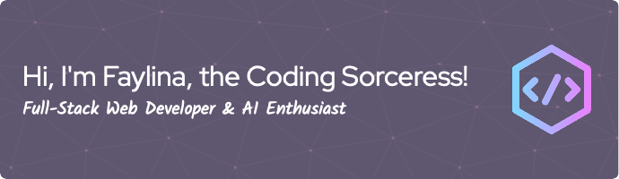

- 👀 I’m a certified **full-stack web developer** (JavaScript, PHP, Python, HTML, CSS).
- 🌱 I’m currently learning **AI**, machine learning and data science.
- 💞️ I’m looking for new professional challenges!
- 📫 You can reach me via the **contact** form on my portfolio website [CodingSorceress.com](https://codingsorceress.com/)
- ⚡ [CodingSorceress.com](https://codingsorceress.com/) is built completely from scratch and has provided me with a deeper understanding of the complete web development process, **web design**, **security**, **server administration** including **email** and **database management**. And has been a lot of fun!
- 😄 Fun fact: I'm also a seasoned **psychologist** with **leadership** experience and **love learning** and growing!

